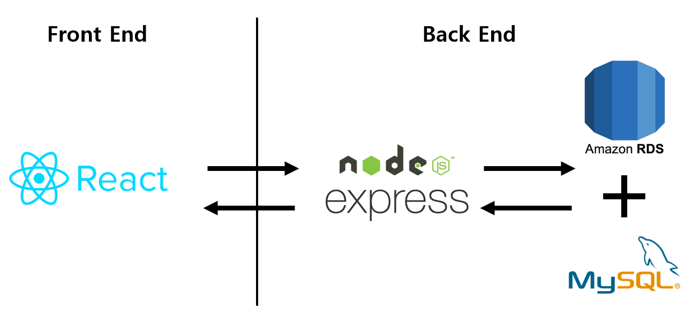

불편수거함🤔🗑🗑
===

</img>

#### 서비스소개

일상속에서 느끼는 불편한 점, 좋지 않았던 경험을 사람들에게 알려 **공감을 유도하는 서비스**❤❤ 입니다.

다른사람들이 미처 몰랐던 불편한 점을 **공론화**📢 하여 이를 해결할 수 있도록 유도 해 준다는 장점이 있습니다.👍

#### 팀 소개
디자인 - 1명 👩‍🎨     
프론트엔드 - 2명 👨‍💻👨‍💻  
백엔드 - 2명 👩‍💻👨‍💻     

----

### 1. 시스템 구성도
</img>   
-프론트엔드의 경우 **React.js**를 사용   
-백엔드 서버의 경우 **Node.js의 Express**를 통해 API 서버 개발   
-데이터베이스는 **AWS RDS의 MySQL**을 사용   

### 2. 기능 소개  🎊🎊
* 회원   
-일반 회원가입, OAuth를 사용한 구글 로그인 및 회원가입 기능    
-로그인, 로그아웃, 회원탈퇴   

* 개시글   
-글 조회, 추가, 수정, 삭제      
-일일 기준 공감 최대 수에 따른 정렬      
-공감수 추가, 삭제   
-댓글 추가, 수정, 삭제   
